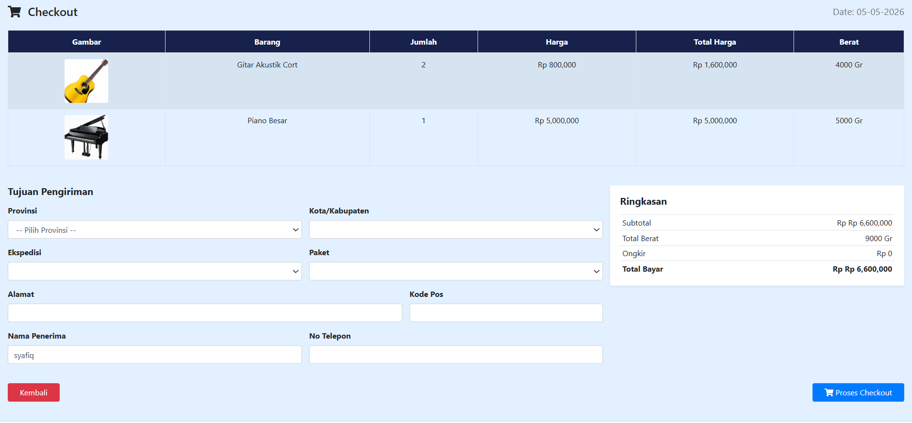
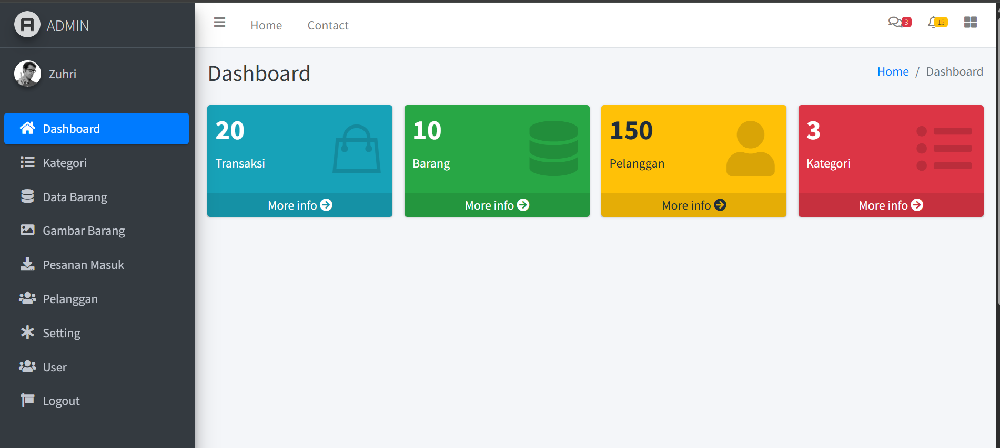

# Simple E-Commerce Website

Untuk login admin tulis URL : http://localhost/mstore/auth/login_user
user : admin
pass : admin
Di halaman admin berfungsi untuk memproses pesanan pelanggan, menginput barang, dan setting lokasi toko
## 🚀 Features
- Product listing and catalog
- User authentication (login & register)
- Shopping cart functionality
- Order/checkout simulation
- Admin panel for product management (CRUD)

## 🛠 Tech Stack
- PHP
- MySQL
- HTML
- CSS
- JavaScript

## 📸 Screenshots
### Home Page

### Product Page

### Cart Page

### Login

### Checkout

### Admin

## ⚙️ Installation & Setup
1. Clone repository
bash git clone https://github.com/ZuhriSyafiq/mstore
2. Move project to htdocs (XAMPP)
3. Import database (.sql file) to phpMyAdmin
4. Run on browser: http://localhost/mstore

